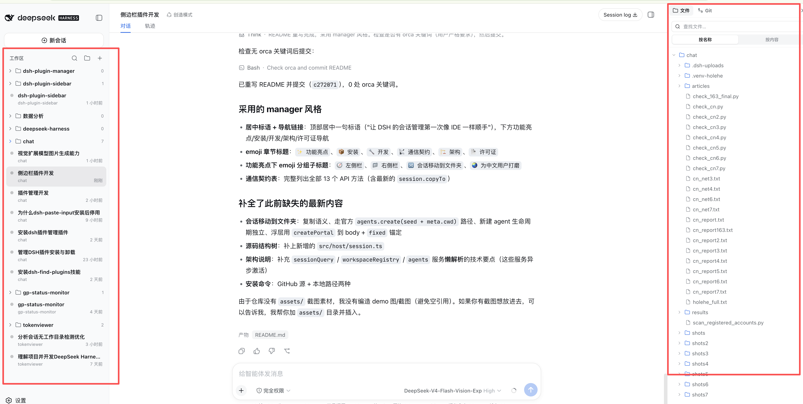
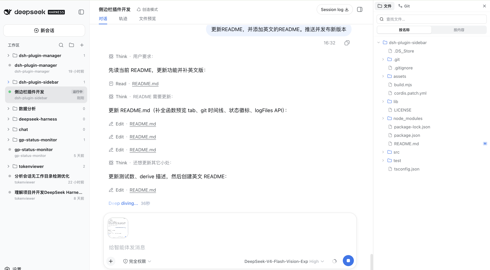
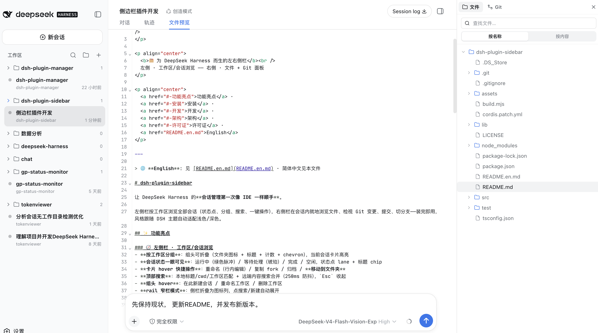
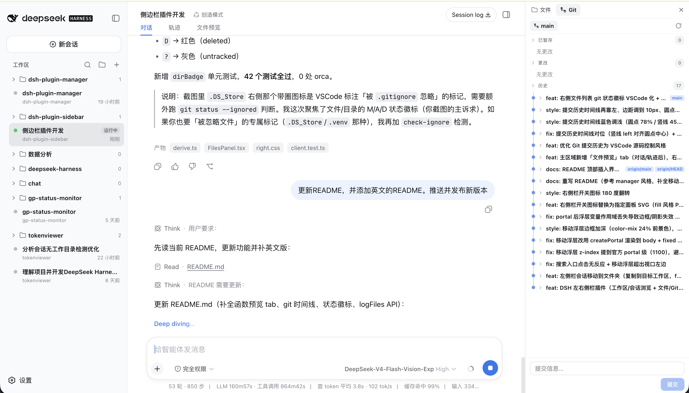

<p align="center">
  
</p>

<p align="center">
  <b>🗂️ A left & right sidebar for DeepSeek Harness</b><br />
  Left · workspace/session browsing — Right · file + Git panels
</p>

<p align="center">
  <a href="#-highlights">Highlights</a> ·
  <a href="#-install">Install</a> ·
  <a href="#-development">Development</a> ·
  <a href="#-architecture">Architecture</a> ·
  <a href="#-license">License</a> ·
  <a href="README.md">中文</a>
</p>

---

> 🌐 **简体中文**: 见 [README.md](README.md) · English in this file

# dsh-plugin-sidebar

Make DeepSeek Harness **session management feel like an IDE**.

Browse every session by workspace on the left (status dots, groups, search, one-click actions); browse files and review Git changes in-place on the right (commit, switch branches). Install and go — styling follows the DSH theme and adapts to light/dark.

## ✨ Highlights

### 🧭 Left sidebar · workspace/session browsing
- **Grouped by workspace**: collapsible group headers (folder icon + title + count + chevron), active session highlighted
- **Session status at a glance**: running (green pulse) / waiting (amber) / done / idle — status lane + title chip
- **Hover quick actions**: rename (inline) / fork / archive / **move to folder**
- **Top search**: local title/cwd/workspace match merged with remote content search (250 ms debounce), `Esc` to dismiss
- **Group-hover actions**: new session here / rename workspace / delete workspace
- **Rail mode**: sidebar collapses to an icon column; search/new auto-expand

### 📁 Right sidebar · file browsing + Git panel
- **Session-header toggle** (next to the session log download); **toggle state is remembered per session** — a session you opened the panel in stays open after switching away and back
- **File explorer**: lazy directory tree (expand to load children), name search, content search (file/line/text), **directory git-status aggregation badges** (highest priority D>M>A>R>U of changed files underneath)
- **File preview tab (CodeMirror editing)**: a **File preview** tab after the main region's **Conversation / Trajectory** tabs; clicking a file in the right sidebar auto-switches there. Text files render with **CodeMirror 6** — **syntax highlighting** (language auto-picked by extension) + **editable** + **save back to disk** (`●` unsaved marker + save button, head pinned so it's always visible); binary/large files show a notice
- **Git panel**: status split into **Staged / Changes** (`--porcelain=v1 -z` NUL parsing), colored diff, commit box, branch switch
- **Bulk actions (VSCode Source Control style, on section-header hover)**: `Stage all`(+) / `Unstage all`(−) / `Discard all`(undo); per-file row hover: diff(file) + stage(+)/unstage(−) + discard(undo)
- **Commit history (VSCode Source Control style)**: timeline dots + connector line, one-line-truncated message; expand to reveal author · date + that commit's **changed-file list** (M/A/D colored letters), files lazy-loaded on demand







### 🔀 Move session to folder
- Copy semantics (fork): the source session stays; a new session is created in the target workspace inheriting **all completed history**, auto-opened after creation
- Uses the official `agents.create(seed + meta.cwd)` path; the new session is an **agent** (lifecycle owned by the agent registry, not removed when the plugin stops)
- Target-workspace picker: `createPortal` to body + `position: fixed` anchored, escaping list `overflow` clipping, flips upward near the viewport bottom

### 🌏 Polished for Chinese users
- Full Chinese UI + English, follows the DSH locale automatically
- Uses only DSH theme tokens (`--dsw-alias-*` / `--ds-*`), adapting to light/dark

## 📦 Install

```bash
# From GitHub
dsh plugin --profile web add github:webkong/dsh-plugin-sidebar#main

# Or from a local path (development)
dsh plugin --profile web add /path/to/dsh-plugin-sidebar
```

After restarting `dsh web`, the left sidebar takes over `sidebar.workspaces`, the right sidebar takes over the `details` column, and a panel toggle appears in the session header.

> ⚠️ Takes effect after install/restart; Host changes require a `dsh web` restart, while Client changes (`lib/client.js`) only need a page refresh.

## 🔖 Version Compatibility

| Plugin version | Compatible dsh versions | Notes |
| --- | --- | --- |
| **0.3.x** | ≥ 0.1.1-rc.2 (verified on 0.1.1-rc.2 and 0.1.2-alpha.1) | Removed `dsh-client-runtime` from the client `inject` list (that package was removed in dsh 0.1.2) |
| ≤ 0.2.x | ≤ 0.1.1-rc.x | On dsh ≥ 0.1.2 older clients never load while waiting for the removed `dsh-client-runtime` |

## 🔧 Development

```bash
npm install          # esbuild / typescript (dev only)
npm run build        # esbuild src/ → lib/ (Host ESM + Client __ModuleLoader__ bundle)
npm run typecheck    # tsc --noEmit strict
npm test             # node --test pure-function unit tests (42 cases)
npm run check        # typecheck + bundle syntax checks + unit tests
```

### Structure (TypeScript-modular)

Source is organized TypeScript-modular (modeled on the official UI plugins); build output lives in `lib/`:

```
dsh-plugin-sidebar/
├── package.json              # dsh.bundle / dsh.client declarations, scripts
├── cordis.patch.yml          # bundle patch: mounts the dsp-sidebar row
├── build.mjs                 # esbuild build (Host ESM + Client __ModuleLoader__ bundle)
├── tsconfig.json             # strict typecheck (node + DOM/React)
├── lib/                      # build output (gitignored)
│   ├── index.js              # Host single-file ESM bundle
│   └── client.js             # Client __ModuleLoader__ bundle
├── src/
│   ├── host/                 # Host source (Node env)
│   │   ├── index.ts          # entry: name/inject/apply + webServer route registration
│   │   ├── session.ts        # session copy (move to folder): readSession → cut → agents.create(seed+meta.cwd)
│   │   ├── git.ts            # git ops: runGit + porcelain/NUL/log parsing
│   │   ├── fs.ts             # fs ops: listDir / readText (512 KB truncation)
│   │   ├── search.ts         # search: name recursion + content line matching
│   │   └── http.ts           # JSON responses / loopback check / body / escaping
│   └── client/               # Client source (DOM + React env)
│       ├── index.ts          # apply entry: inject styles / register dictionaries / register slots
│       ├── api.ts            # /dsp-sidebar/api fetch wrapper
│       ├── i18n.ts           # zh/en dictionary (NS + key types)
│       ├── types.ts          # contracts: session/workspace data plane + Host API + git wire shapes
│       ├── util.ts           # shared helpers: relative time / basename / status derivation
│       ├── icons.tsx         # icons (lucide-style stroke + right-panel filled glyph)
│       ├── previewStore.ts   # file-preview shared store (sessionId-scoped, useSyncExternalStore)
│       ├── preview/          # main-region "File preview" view
│       │   └── PreviewView.tsx  # conversation.view occupant: subscribes to previewStore
│       ├── styles/           # CSS split by component domain + aggregate injection
│       │   ├── left.css      # left sidebar styles
│       │   ├── right.css     # right sidebar styles
│       │   ├── preview.css   # main-region preview tab styles (global dsw tokens)
│       │   └── index.ts      # injectStyles (idempotent single style tag)
│       ├── left/             # left sidebar (aligned with official WorkspaceBrowser + rows/)
│       │   ├── derive.ts     # data derivation: grouping / search merge
│       │   ├── rows.tsx      # row components: SessionCard / SearchRow / GroupSection (incl. move portal)
│       │   └── WorkspaceBrowser.tsx  # main component: header + search + list + rail
│       └── right/            # right sidebar (aligned with official RightSidebar + SourceControl + FileExplorer)
│           ├── derive.ts     # git status classification (badge / staged / unstaged / untracked / dirBadge)
│           ├── FilesPanel.tsx   # file browser (lazy tree + search + preview + git badges)
│           ├── GitPanel.tsx     # git panel (status / stage / diff / commit / timeline history / branch)
│           └── RightPanel.tsx   # panel shell (activity bar + tab switch) + header toggle
└── test/                     # pure-function unit tests (node --test)
```

## 📡 Communication contract

The Host exposes an HTTP API via a `webServer` prefix route `/dsp-sidebar/api` (loopback only, POST, method name as the last path segment); the Client calls it with browser `fetch`:

| Method | Description |
| --- | --- |
| `fs.list` | list dir (`{path}`) |
| `fs.read` | read text (512 KB truncation; binary returns `kind:'binary'`) |
| `fs.search` | search (`{mode: 'name'\|'content', path, query}`) |
| `fs.gitStatus` | dir git-status map (path → XY, for file badges) |
| `git.status` | git status (`{cwd}`) |
| `git.diff` | diff (`{cwd, path?, staged?}`) |
| `git.stage` / `git.unstage` | stage / unstage (`{cwd, path?}`) |
| `git.discard` | discard changes (`{cwd, path}`) |
| `git.commit` | commit (`{cwd, message}`) |
| `git.log` | commit history (`{cwd, count?}`) |
| `git.logFiles` | changed files of one commit (`{cwd, hash}`, name-status parsed) |
| `git.branches` | branch list (`{cwd}`) |
| `git.checkout` | checkout branch (`{cwd, branch}`) |
| `session.copyTo` | copy session to target workspace (`{srcId, targetPath}`) → returns `{sessionId}` |

## 🏗 Architecture

- **Host** (`src/host/`): registers the `/dsp-sidebar/api` prefix route via `webServer`. File ops go through the mounted `fs` service (`resolve` → `listDir`/`stat`/`readText`/`readBytes`, respecting sandbox & observation policy); git ops go through the mounted `shell` service (`resolve` + `run`, `git -C <cwd>` + porcelain/NUL parsing — the same execution path as the official bash tool)
- **Client** (`src/client/`): calls the Host via `fetch('/dsp-sidebar/api/...')`; registers slots (`sidebar.workspaces` / `details` / `conversation.session.header.utilities` / `conversation.view`); session copy uses Host services like `sessionQuery` / `workspaceRegistry` / `agents` (lazy resolution — these activate asynchronously, so `ctx.get` at call time rather than cached at `apply`)

## 📄 License

[MIT](LICENSE)
